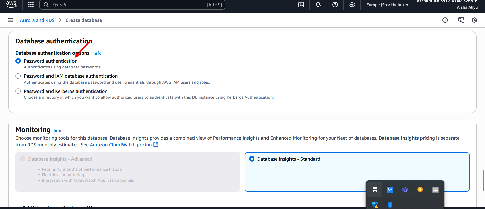

# Word-Press-Site-On-AWS 

# Part 1 — Create the VPC

1. Log in to your AWS account.

2. In the search bar at the top, type VPC and click it.

3. Click Create VPC.

    Choose:
VPC only (simpler) OR VPC and more (AWS will create subnets, route tables, and an Internet Gateway for you automatically — good for beginners).
4. Enter:
 Name tag: WordPress-VPC
 IPv4 CIDR block: 10.0.0.0/16

5. Leave IPv6 off (optional for now).

 6. Click Create VPC.
 #[name-vpc](./New-Pic-24/2.name-vpc.png).

# Part 2 — Create Subnets
We need public and private areas.

1. In the left menu, click Subnets → Create subnet.
.

2. Select your WordPress-VPC.
'

3. Create:
- Public Subnet A:
CIDR block: 10.0.1.0/24
Availability Zone: pick your preferred region/AZ
.

- Private Subnet A:
CIDR block: 10.0.2.0/24
Availability Zone: same region but can be same or different AZ.
.

# Part 3 — Create an Internet Gateway
This is the gate for your public subnet.

1. Left menu → Internet Gateways → Create internet gateway.
.

2. Name it: WordPress-IGW.
.

3. Click Attach to VPC and choose WordPress-VPC.
.

.

# Part 4 — Create Route Tables
We make two:
# Public Route Table:
1. Left menu → Route Tables → Create route table.
.

2. Name: WordPress-Public-RT.
.

3. Attach to WordPress-VPC.
4. In the Routes tab → Edit routes → Add route:
.
- Destination: 0.0.0.0/0

- Target: Your Internet Gateway.
.

5. In the Subnet associations tab → Associate with Public Subnet A.
.
.

# Private Route Table:
1. Same steps as above, name it WordPress-Private-RT.

2. No internet gateway route.

3. Associate with Private Subnet A.

.

# NAT Gateway for Private Internet Access
Purpose: Allows private resources to initiate outbound internet connections (updates, package installs) without being exposed to inbound traffic.

Steps:

1. VPC → NAT Gateways → Create NAT Gateway.

2. Subnet: Choose your Public Subnet (must be public so NAT can reach internet).
3. Elastic IP: Allocate a new Elastic IP.

Create.

# Update Private Route Table
Steps:
1. Go to Route Tables → Private Route Table.

2. Edit routes:
.

# Create the Amazon RDS MySQL Instance
Purpose: A managed MySQL database so you don’t have to worry about manual installation, backups, or patching.

1. In AWS Console → RDS → Create database.
.

2. Engine type → Choose MySQL.
.

3. Templates:

- For learning/testing → Free tier (if available).

- For production → Production (enables Multi-AZ, backups, etc.).
.

4. DB instance identifier → wordpress-db.
.

5. Master username → e.g., admin.

6. Master password → Create a strong password and save it (you’ll need it for WordPress).
.

7. Instance class → e.g., db.t3.micro for testing, bigger for production.
.

8. Storage:

- Start small (20 GB GP2/GP3) and enable autoscaling if needed.

9. Connectivity:

- VPC → Choose your WordPress-VPC.

- Subnet group → Select your private subnets (RDS should be private).

- Public access → No.
.

- VPC security group → Create or choose one that only allows MySQL (port 3306) from your WordPress EC2 security group.

10. Database authentication → Password authentication.
.

11. Create database.

# Configure Security Groups for RDS
1. Go to EC2 → Security Groups.

2. Find the security group attached to your RDS instance.

3. Edit inbound rules:

- Type → MySQL/Aurora

- Port → 3306

- Source → Select the security group of your WordPress EC2 instance (not “Anywhere”).

4. Save changes.